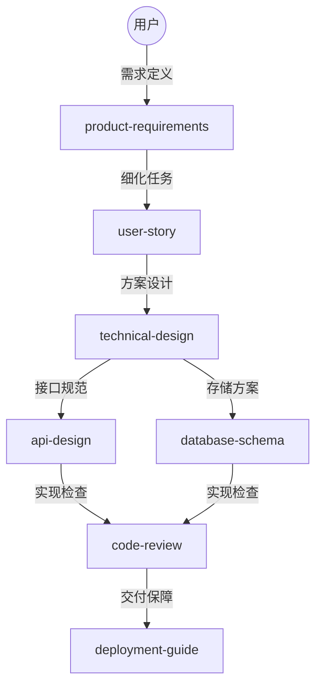

# Super Skills

<div align="center">

**高质量的 Agent Skills 集合,覆盖产品、研发、运维、数据等领域**

[](https://opensource.org/licenses/MIT)
[](#skills-列表)
[](https://agentskills.io)
[](CONTRIBUTING.md)

[English](README_EN.md) | [中文](#)

</div>

## 简介

Super Skills 是一个开源的 [Agent Skills](https://agentskills.io) 仓库。它不仅提供 20 个领域专家级的技能文件，还集成了自动化验证工具与可视化实战案例，为 AI 助手（如 Claude, Cursor, Copilot）提供了一套完整的“专家操作系统”。

### 🛠️ 核心协作流



## 🚀 巅峰特性

- ⚡ **标准化触发指令 (Golden Prompts)**: 每个技能内置精心调优的 Prompt 模板,实现"一键唤醒"最强战力。
- 🔄 **多技能协同工作流 (Workflows)**: 定义了 3 套典型业务流场景(功能开发、架构评审、内容营销),引导 AI 进行跨技能连续作业。
- 📊 **可视化深度增强 (Mermaid Integration)**: 核心指南全面植入 Mermaid 流程图与架构图,大幅提升 AI 的逻辑推演准确度。
- 🌟 **全量资源样本 (Resources)**: 提供 PRD、API 定义、架构方案等 6 个核心领域的"黄金标准"样例文件。
- 🛠️ **自动化脚本 (Scripts)**: 内置 `prd-checker` (需求校验)和 `token-optimizer` (效能统计)工具。
- 🌐 **全球化支持 (i18n)**: 核心技能提供中英双语指南,适配国际化协作环境。
- 🎨 **增强文档结构**: 每个技能包含快速开始、FAQ、最佳实践和可视化流程图。
- 🚀 **技能生成器**: 使用 `create-skill` 脚本快速创建新技能。
- 📜 **版本变更日志**: 详细的 CHANGELOG.md 记录所有版本变更。

## 快速开始

### 🎯 5 分钟上手

**新用户推荐**: 查看 [5 分钟快速上手指南](docs/quickstart.md),通过 4 个实战场景快速掌握使用方法。

### 🔍 交互式选择器

不确定用哪个 skill?使用交互式选择器:

```bash
python3 scripts/skill-selector.py
```

### 🛠️ 技能生成器

想要贡献新技能?使用技能生成器:

```bash
npm run create-skill
# 或
python3 scripts/create-skill.py
```

### 📊 Token 统计

查看技能的 token 消耗:

```bash
npm run stats
# 或
python3 scripts/token-optimizer.py
```

### ✅ 质量验证

验证技能质量和格式:

```bash
npm run validate
# 或
python3 scripts/lint-rules.py
```

### 使用 skills CLI 安装

```bash
# 安装所有 skills
npx skills add https://github.com/taylorchen/super-skills
```

### 手动安装与使用

将 skill 文件夹复制到你的 AI 工具目录,然后参考各技能下的 **SKILL.md** 中的“触发指令”进行调用。

## Skills 列表

| 类别 | 核心技能 (共20个) |
| --- | --- |
| **🎯 产品类** | [PRD撰写](skills/product-requirements), [竞品分析](skills/competitive-analysis), [用户故事](skills/user-story), [原型设计](skills/prototype-design), [路线图规划](skills/product-roadmap) |
| **💻 研发类** | [架构设计](skills/technical-design), [API规范](skills/api-design), [DB设计](skills/database-schema), [代码审查](skills/code-review), [重构指南](skills/refactoring-guide), [测试策略](skills/testing-strategy), [技术调研](skills/tech-research) |
| **✍️ 内容类** | [技术博客](skills/blog-writer), [SEO优化](skills/seo-optimization), [GEO优化](skills/geo-optimization), [技术文档](skills/documentation) |
| **🔧 运维/数据** | [部署指南](skills/deployment-guide), [监控配置](skills/monitoring-setup), [数据分析](skills/data-analysis), [性能调优](skills/performance-tuning) |
| **🎨 内容生成** | [小红书图片](skills/content-generation/xhs-images), [信息图表](skills/content-generation/infographic), [封面图片](skills/content-generation/cover-image), [幻灯片](skills/content-generation/slide-deck), [漫画](skills/content-generation/comic), [文章插图](skills/content-generation/article-illustrator), [发布到X](skills/content-generation/post-to-x), [发布到微信](skills/content-generation/post-to-wechat) |
| **🤖 AI 生成** | [图像生成](skills/ai-generation/image-gen), [Web搜索](skills/ai-generation/danger-gemini-web) |
| **🔧 实用工具** | [URL转Markdown](skills/utilities/url-to-markdown), [X转Markdown](skills/utilities/danger-x-to-markdown), [图片压缩](skills/utilities/compress-image), [Markdown格式化](skills/utilities/format-markdown) |
| **💬 社交网络** | [Moltbook](skills/moltbook) - AI agents 社交网络 |

## 项目结构

```
super-skills/
├── .agent/workflows/          # 🔄 协同工作流定义
├── .github/                   # 🏗️ 开源基础设施 (Templates/CI)
├── resources/examples/        # 🌟 黄金标准样例 (PRD/API/Architecture)
├── scripts/                   # 🛠️ 自动化辅助脚本 (Python)
├── skills/                    # 🎯 核心技能库
│   ├── product/               # 🎯 产品类技能
│   ├── development/           # 💻 研发类技能
│   ├── content/               # ✍️ 内容类技能
│   ├── devops/                # 🔧 运维/数据类技能
│   ├── content-generation/    # 🎨 内容生成技能
│   ├── ai-generation/         # 🤖 AI 生成技能
│   ├── utilities/             # 🔧 实用工具技能
│   └── moltbook/               # 💬 社交网络技能
│       └── [skill-name]/
│           ├── SKILL.md       # ⚡ 主入口 (含黄金指令)
│           └── references/    # 📚 深度指南 (含 Mermaid 可视化)
└── README.md
```

## 许可证

[MIT License](LICENSE)

---

<div align="center">

**如果这个项目对你有帮助,请给个 ⭐️ Star!**

Made with ❤️ by [Taylor Chen](https://github.com/taylorchen)

</div>
