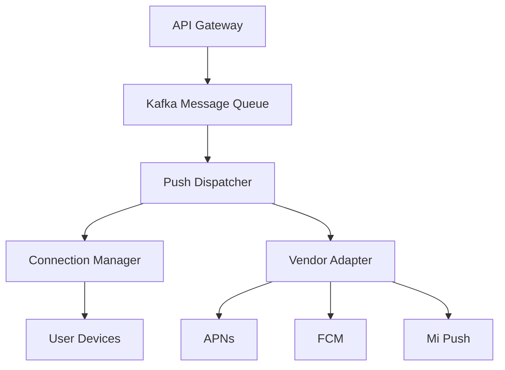

# 示例：亿级日活消息推送系统 (Push Platform) 架构设计

## 1. 业务背景

**现状**: 系统需支持单日推送 10 亿+ 消息,且需在 1 秒内完成 100 万级用户的瞬时触达。
**痛点**: 长连接维护成本高、下行链路带宽容易打满、各厂商 SDK(iOS, Android) 推送逻辑不统一。

## 2. 核心架构

### 2.1 整体拓扑 (Top View)

### 2.2 关键组件职责

| 组件 | 技术选型 | 核心职责 |
| --- | --- | --- |
| **API Gateway** | APISIX | 鉴权、频率限制 (Rate Limiting) |
| **MQ (Kafka)** | 3 Broker Cluster | 解耦下发链路、应对波峰脉冲 |
| **Dispatcher** | Go Service | 消息路由逻辑、模板渲染、黑名单过滤 |
| **Connection Mgr** | Go + Netpoll | 维护千万级 TCP 长连接,心跳保活 |
| **Cache (Redis)** | Redis Cluster | 存储用户在线状态、设备 Token 映射 |

## 3. 核心设计挑战

### 3.1 极高性能下发 (Throughput)
- **方案**: 采用分片队列模式。Dispatcher 内部应用本地限时 Batch 策略,将单条消息聚合后成批下发至连接管理层。
- **目标**: P99 触达延迟 < 800ms。

### 3.2 动态负载均衡 (Load Balance)
- **方案**: 由 Consul 配合独立分配逻辑。设备登录时,系统根据 Connection Manager 节点的当前连接数分布,动态下发最优的长链接 IP。

## 4. 容灾与降级 (Resilience)

- **限流熔断**: 当 MQ 积压超过阈值,自动对非核心业务(如活动通告)启用慢速模式,优先保证交易类通知下发。
- **离线存储**: 针对不在线的用户,消息进入 Redis 过期队列,等待用户上线后 1 小时内自动补推。

## 5. 监控与观测

- **指标**: 成功率、延迟(API到设备)、长连接在线总数、厂商到达率。
- **告警**: 厂商 API 报错率超过 5% 即触发 P0 级告警。
