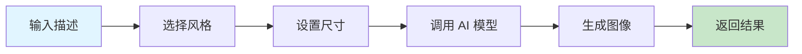

# 图像生成器

AI 驱动的图像生成工具，支持多种风格和主题的图像创建。

## 快速开始

### 5 步上手

1. **准备输入** - 准备好图像描述
2. **触发技能** - 在 AI 工具中输入 `/image-gen-full`
3. **选择风格** - 选择适合的图像风格
4. **设置参数** - 设置图像尺寸、质量等参数
5. **生成图像** - AI 自动生成符合要求的图像

### 使用示例

```
/image-gen-full
风格: realistic
尺寸: 1024x1024
描述: 一只可爱的橘猫坐在窗台上，看着窗外的日落，温暖的光线照进房间
```

## 工作流程



## 加载文件
- [references/guide.md](references/guide.md) - 图像生成使用指南

## 相关 Skills
- [compress-image](../../utilities/compress-image) - 图片压缩工具
- [xhs-images](../../content-generation/xhs-images) - 小红书图片生成

## 示例
- 📄 [示例文件](../../resources/examples/image-gen/sample.md)

## 检查清单
- [ ] 确保描述清晰具体
- [ ] 选择适合的风格
- [ ] 设置合适的图像尺寸
- [ ] 检查生成的图像质量
- [ ] 根据需要进行后续处理

## 最佳实践

### 描述技巧

- ✅ 使用具体的形容词和细节
- ✅ 描述场景、光线和氛围
- ✅ 说明构图和视角
- ✅ 提及颜色和材质

### 风格选择

- ✅ 根据用途选择合适的风格
- ✅ 为不同平台选择适合的风格
- ✅ 考虑目标受众的偏好

### 尺寸设置

- ✅ 为社交媒体选择平台推荐的尺寸
- ✅ 为网页使用标准的网页图像尺寸
- ✅ 为打印选择高分辨率尺寸

## 常见问题

**Q: 生成的图像与描述不符怎么办？**
A: 尝试更详细的描述，明确指出关键元素和细节。

**Q: 生成速度很慢怎么办？**
A: 图像生成是计算密集型任务，可能需要一些时间。对于大型图像，时间会更长。

**Q: 生成的图像质量不高怎么办？**
A: 尝试提高描述的具体性，选择更适合的风格，或增加图像尺寸。

**Q: 某些主题无法生成怎么办？**
A: AI 模型有内容政策限制，某些主题可能无法生成。请尝试其他主题。

## 触发指令

⚠️ **Prompt-as-Code (v5.0)**: 触发指令已迁移至 `metadata.json`。支持：
- `/image-gen-full` - 完整图像生成，支持风格和尺寸设置
- `/image-gen-quick` - 快速图像生成，使用默认设置

## Token 效率

- 主 Skill 文件: ~300 tokens
- 参考指南总计: ~2k+ tokens
