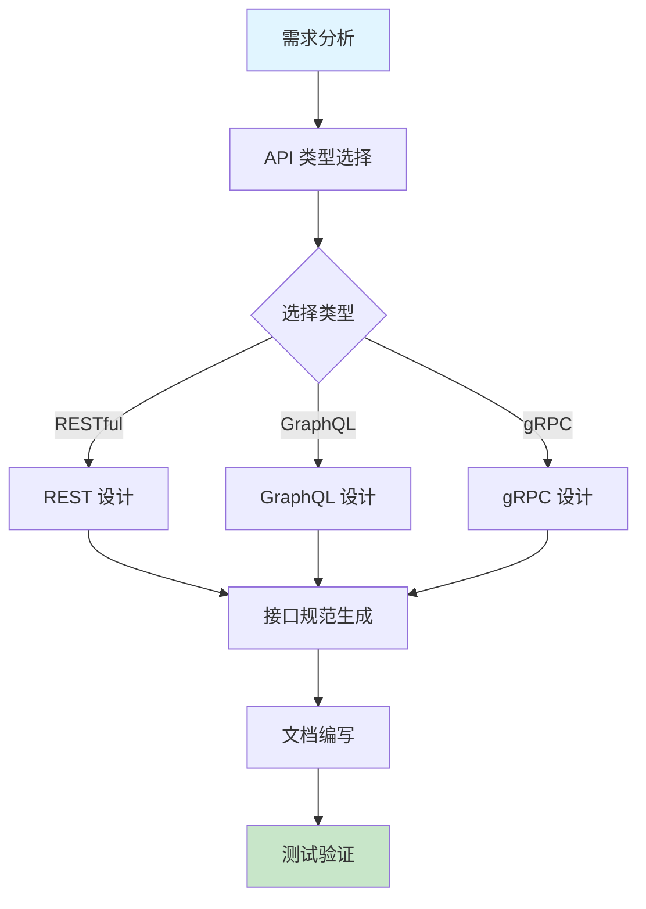

# API 设计规范

RESTful, GraphQL, gRPC 设计指南。

## 快速开始

### 5 步上手

1. **准备输入** - 明确业务需求和数据模型
2. **触发技能** - 在 AI 工具中输入 `/api-design-full`
3. **描述需求** - 提供业务场景和接口需求
4. **生成方案** - AI 生成完整的 API 设计方案
5. **迭代优化** - 根据反馈调整接口设计

### 使用示例

```
/api-design-full
请设计一个用户管理系统的 RESTful API，包括：
1. 用户注册、登录、登出
2. 个人信息管理
3. 权限控制
4. 支持 JWT 认证
```

## 工作流程



## 加载文件
- [AGENTS.md](AGENTS.md) (核心规则)
- [references/guide.md](references/guide.md) (设计指南)
- [rules/use-nouns-for-resources.md](rules/use-nouns-for-resources.md)
- [rules/implement-idempotency.md](rules/implement-idempotency.md)

## 相关 Skills
- **database-schema**, **technical-design**, **documentation**

## 示例
- 📄 [restful-api-sample.md](../../resources/examples/api-design/restful-api-sample.md)
- 📄 [api-spec-sample.yaml](../../resources/examples/api-design/api-spec-sample.yaml)

## 检查清单
- [ ] URL 名词复数 (如 `/users`)
- [ ] HTTP 方法正确 (GET/POST/PUT/DELETE)
- [ ] 标准 HTTP 状态码 (201, 204, 422)
- [ ] 响应包含统一的 request_id
- [ ] 接口版本控制 (`/v1/`)

## 最佳实践

### RESTful 设计
- ✅ **资源命名** - 使用名词复数表示资源（如 `/users` 而非 `/user`）
- ✅ **HTTP 方法** - 正确使用 GET(查询)、POST(创建)、PUT(更新)、DELETE(删除)
- ✅ **状态码** - 使用标准 HTTP 状态码，语义明确
- ✅ **版本控制** - 在 URL 中包含版本号（如 `/v1/users`）
- ✅ **过滤排序** - 支持参数化的过滤、排序和分页

### GraphQL 设计
- ✅ **Schema 设计** - 定义清晰的类型系统和关系
- ✅ **查询优化** - 避免 N+1 查询问题，使用批处理
- ✅ **权限控制** - 在 resolver 层面实现细粒度权限
- ✅ **缓存策略** - 合理使用缓存减少重复查询

### gRPC 设计
- ✅ **服务定义** - 清晰的 protobuf 服务和消息定义
- ✅ **错误处理** - 使用标准的 gRPC 状态码
- ✅ **流处理** - 合理使用单向流和双向流
- ✅ **性能优化** - 控制消息大小，使用压缩

### 通用原则
- ✅ **幂等性** - 确保重复请求产生相同结果
- ✅ **安全性** - 实现适当的认证和授权
- ✅ **可观测性** - 包含请求追踪和监控
- ✅ **文档** - 提供清晰的 API 文档

## 常见问题

**Q: 如何选择 RESTful、GraphQL 还是 gRPC?**
A: 根据具体场景选择：
- RESTful: 适合简单 CRUD 操作，浏览器友好，生态成熟
- GraphQL: 适合复杂数据查询，前端灵活获取数据，减少网络传输
- gRPC: 适合内部服务通信，性能要求高，强类型契约

**Q: 如何设计合理的 API 版本控制?**
A: 常见的版本控制方式：
1. URL 路径版本：`/v1/users` (推荐)
2. 请求头版本：`Accept: application/vnd.example.v1+json`
3. 查询参数版本：`/users?version=1` (不推荐)

**Q: 如何处理 API 错误响应?**
A: 使用统一的错误响应格式，包含：
- 错误代码 (error code)
- 错误消息 (message)
- 请求 ID (request_id)
- 时间戳 (timestamp)
- 详细信息 (details, 可选)

**Q: 如何保证 API 的安全性?**
A: 实现以下安全措施：
- 使用 HTTPS
- 实现认证机制 (JWT, OAuth2)
- 权限控制和访问限制
- 输入验证和参数校验
- 防止 CSRF 和 XSS 攻击
- 速率限制防止滥用

**Q: 如何设计 API 的扩展性?**
A: 考虑以下因素：
- 模块化设计
- 合理的资源命名和层级
- 支持字段选择和扩展
- 预留字段和灵活的响应结构
- 避免破坏性变更

## 触发指令

⚠️ **Prompt-as-Code (v5.0)**: 触发指令已迁移至 `metadata.json`。支持：
- `/api-design-full` - 完整 API 设计
- `/api-design-quick` - 快速 API 评估

## Token 效率

- 主 Skill 文件: ~300 tokens
- 参考指南总计: ~4k+ tokens
