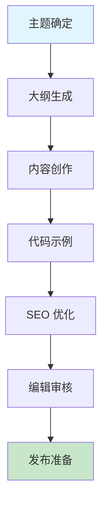

# 技术博客撰写

高质量技术写作指南，帮助创作专业内容。

## 快速开始

### 5 步上手

1. **准备输入** - 明确博客主题和目标受众
2. **触发技能** - 在 AI 工具中输入 `/blog-writer-full`
3. **描述需求** - 提供博客主题、目标和风格要求
4. **生成内容** - AI 自动生成完整的博客内容
5. **编辑优化** - 根据反馈调整内容并发布

### 使用示例

```
/blog-writer-full
请撰写一篇关于 "AI 技能开发最佳实践" 的技术博客，目标受众是软件开发者，风格专业但易懂，包含代码示例和实际案例
```

## 工作流程



## 加载文件
- [references/guide.md](references/guide.md) (详细指南)

## 相关 Skills
- **documentation** - 文档编写技巧
- **seo-optimization** - 搜索引擎优化
- **code-review** - 代码示例审查

## 示例
- 📄 [blog-sample.md](../../resources/examples/blog-writer/blog-sample.md)

## 检查清单
- [ ] 标题具吸引力且含关键词
- [ ] 结构清晰 (引言-正文-结论)
- [ ] 代码示例完整可运行
- [ ] 配备 Meta Description
- [ ] 包含内部和外部链接
- [ ] 优化图片和多媒体内容
- [ ] 适配不同设备的可读性

## 功能特性

- ✅ **智能大纲** - 自动生成符合逻辑的博客大纲
- ✅ **内容创作** - 生成专业、易懂的技术内容
- ✅ **代码示例** - 提供完整可运行的代码示例
- ✅ **SEO 优化** - 自动进行关键词优化和 Meta 标签生成
- ✅ **格式美化** - 优化文章格式和排版
- ✅ **多风格支持** - 支持不同的写作风格和语气

## 最佳实践

### 内容结构
- ✅ **引人入胜的标题** - 使用数字、问题或强力动词
- ✅ **清晰的层次结构** - 使用小标题和段落分隔
- ✅ **有力的引言** - 吸引读者并明确主题
- ✅ **详细的正文** - 提供有价值的信息和见解
- ✅ **简洁的结论** - 总结要点并提供行动建议

### 技术写作
- ✅ **专业准确** - 确保技术内容的准确性
- ✅ **通俗易懂** - 避免过度使用专业术语
- ✅ **代码示例** - 提供完整可运行的代码
- ✅ **视觉辅助** - 使用图表和图片增强理解
- ✅ **实际案例** - 结合真实案例说明问题

### SEO 优化
- ✅ **关键词研究** - 合理使用目标关键词
- ✅ **Meta 标签** - 优化标题、描述和标签
- ✅ **内部链接** - 链接到相关内容
- ✅ **外部引用** - 引用权威来源
- ✅ **可读性** - 确保内容易于阅读和理解

### 发布准备
- ✅ **语法检查** - 确保无语法和拼写错误
- ✅ **格式检查** - 确保格式一致美观
- ✅ **链接验证** - 确保所有链接正常工作
- ✅ **响应式测试** - 确保在不同设备上显示正常
- ✅ **分享优化** - 优化社交媒体分享设置

## 常见问题

**Q: 如何选择适合的博客主题?**
A: 考虑以下因素：目标受众的需求和痛点、当前技术趋势、你的专业领域、搜索量和竞争度、内容的独特价值。选择你熟悉且能提供独特见解的主题。

**Q: 如何提高博客的可读性?**
A: 保持简短段落（3-4 行）、使用小标题和列表、添加视觉元素、使用简单明了的语言、保持逻辑连贯、添加过渡句、使用适当的语气和风格。

**Q: 如何优化博客的 SEO?**
A: 进行关键词研究、在标题和开头段落使用关键词、优化 Meta 标签、使用描述性 URL、添加内部和外部链接、优化图片 alt 标签、定期更新内容、确保网站加载速度快。

**Q: 如何处理技术博客中的代码示例?**
A: 确保代码完整可运行、添加注释说明关键部分、使用适当的语法高亮、提供上下文和使用场景、包含输入输出示例、定期更新代码以保持最新。

**Q: 如何增加博客的影响力?**
A: 分享到社交媒体和技术社区、与其他博主互动、回应评论、定期发布高质量内容、优化分享按钮、建立邮件订阅、与行业专家合作、参加相关讨论。

## 触发指令

⚠️ **Prompt-as-Code (v5.0)**: 触发指令已迁移至 `metadata.json`。支持：
- `/blog-writer-full` - 完整博客撰写
- `/blog-writer-quick` - 快速内容生成

## Token 效率

- 主 Skill 文件: ~300 tokens
- 参考指南总计: ~2k+ tokens