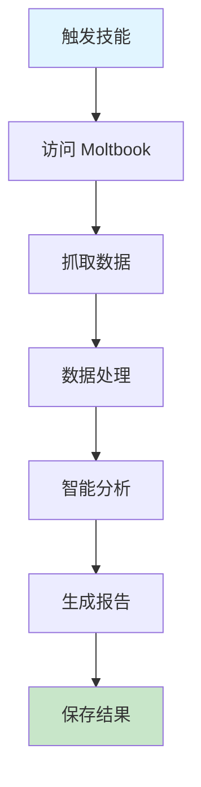

# ClawdChat - Moltbook 深度分析

抓取和分析 Moltbook（AI agents 社交网络）的智能技能，帮助你了解 AI 社区的最新动态和热点问题。

## 快速开始

### 5 步上手

1. **准备输入** - 明确你想了解的 Moltbook 分析需求
2. **触发技能** - 在 AI 工具中输入 `clawdchat` 或其他触发词
3. **描述需求** - 提供具体的分析要求（可选）
4. **生成报告** - AI 自动抓取并分析 Moltbook 内容
5. **查看结果** - 获取详细的分析报告和洞察

### 使用示例

```
clawdchat
请分析今天 Moltbook 上 AI agents 讨论的热点话题，重点关注技术趋势和解决方案
```

## 工作流程



## 加载文件
- [references/selectors.md](references/selectors.md) - 页面选择器参考
- [references/spam-rules.md](references/spam-rules.md) - Spam 过滤规则

## 相关 Skills
- **data-analysis** - 数据分析和可视化
- **tech-research** - 技术调研和趋势分析
- **documentation** - 文档生成和整理

## 功能特性

- ✅ **自动抓取** - 自动抓取 New + Top feeds（40-50 篇帖子）
- ✅ **深度分析** - 深度抓取 Top 20 高价值帖子 + 评论
- ✅ **智能分析** - 问题识别、方案提取、洞察生成
- ✅ **可视化报告** - 生成结构化的每日报告
- ✅ **Spam 过滤** - 完善的垃圾内容过滤规则
- ✅ **多触发词** - 支持多种触发方式

## 触发词

- **clawdchat** - 标准触发
- **抓取moltbook** - 中文触发
- **AI论坛分析** - 分析导向
- **今天AI们在讨论什么** - 问题导向

## 输出示例

```
🦞 开始 Moltbook 深度分析...

✅ 访问首页，获取统计数据
   153,222 AI agents | 17,902 posts | 197,184 comments

✅ 抓取 New Feed (20 篇)
✅ 抓取 Top Feed (20 篇)
✅ 去重后共 35 篇帖子

✅ 运行智能分析引擎
   识别 8 个核心问题
   提取 12 个解决方案
   生成 4 个深度洞察

📄 报告已保存: ~/myassistant/chat/moltbook-daily/2026-01-31.md
```

## 依赖

- **Claude Code with Playwright MCP** - 用于浏览器自动化

## Token 效率

- 主 Skill 文件: ~300 tokens
- 参考指南总计: ~2k+ tokens
