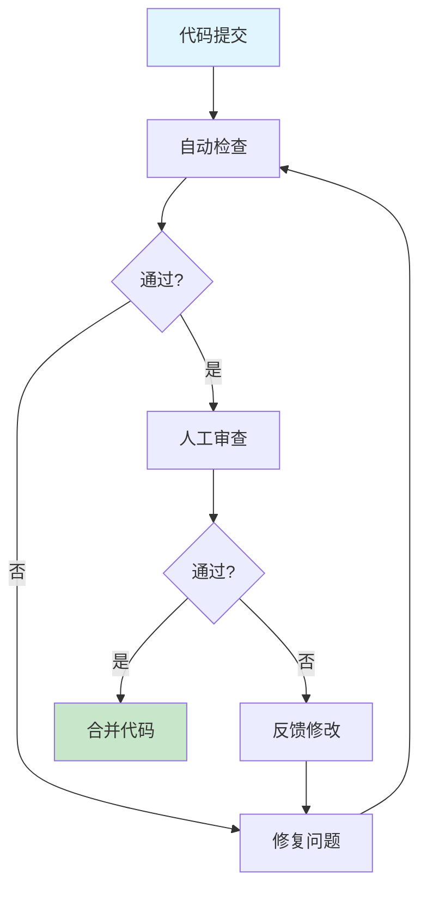

# 代码审查规范

高质量代码 Review 指南，涵盖安全性、性能及可维护性。

## 快速开始

### 5 步上手

1. **准备代码** - 选择需要审查的代码片段或 PR
2. **触发技能** - 在 AI 工具中输入 `/code-review-full`
3. **粘贴代码** - 提供代码上下文和相关文件
4. **获取报告** - AI 生成详细的审查报告
5. **迭代改进** - 根据建议修复问题并重新审查

### 使用示例

```
/code-review-full
请审查以下用户登录代码，重点关注安全性和错误处理：

[粘贴代码]
```

## 工作流程



## 加载文件
- [AGENTS.md](AGENTS.md) (核心程序化规则)
- [references/guide.md](references/guide.md)
- [rules/avoid-sql-injection.md](rules/avoid-sql-injection.md)
- [rules/handle-errors-explicitly.md](rules/handle-errors-explicitly.md)

## 相关 Skills
- **testing-strategy**, **refactoring-guide**, **api-design**

## 示例
- 📄 [review-sample.md](../../resources/examples/code-review/review-sample.md)

## 检查清单
- [ ] 逻辑正确性及边界条件
- [ ] 安全漏洞 (SQL 注入, 凭证泄露等)
- [ ] 代码风格及可读性 (命名, DRY)
- [ ] 潜在性能瓶颈 (索引, 循环)

## 最佳实践

### 审查原则
- ✅ **建设性反馈** - 提供具体的改进建议，而非批评
- ✅ **关注重点** - 优先检查安全性、正确性、性能
- ✅ **保持一致** - 遵循团队统一的代码规范

### 安全审查
- ✅ 检查 SQL 注入、XSS、CSRF 等常见漏洞
- ✅ 验证输入验证和输出编码
- ✅ 审查敏感数据处理和权限控制

### 性能审查
- ✅ 识别 N+1 查询问题
- ✅ 检查不必要的循环和递归
- ✅ 评估数据库索引使用情况

### 可维护性
- ✅ 确保命名清晰、语义明确
- ✅ 检查代码重复，遵循 DRY 原则
- ✅ 验证错误处理和日志记录

## 常见问题

**Q: 审查应该多详细?**
A: 根据代码重要性和风险级别调整。核心代码需要更详细的审查，辅助代码可适当简化

**Q: 如何处理审查意见冲突?**
A: 优先考虑安全性、正确性问题。风格问题遵循团队规范，必要时进行团队讨论

**Q: 审查耗时太长怎么办?**
A: 使用快速检查模式 (`/code-review-quick`)，分批审查，或设置审查时间上限

**Q: 如何提高审查效率?**
A: 建立审查清单，使用自动化工具（linter、静态分析），专注关键问题

## 触发指令

⚠️ **Prompt-as-Code (v5.0)**: 触发指令已迁移至 `metadata.json`。支持：
- `/code-review-full` - 完整代码审查
- `/code-review-quick` - 快速检查
- `/code-review-security` - 专注安全审查

## Token 效率

- 主 Skill 文件: ~250 tokens
- 参考指南总计: ~3k+ tokens
