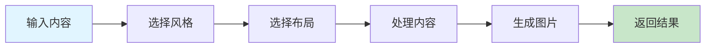

# 小红书图片生成器

生成小红书风格的图片，支持多种风格和布局的图像生成。

## 快速开始

### 5 步上手

1. **准备输入** - 准备好需要转换为小红书风格的内容
2. **触发技能** - 在 AI 工具中输入 `/xhs-images-full`
3. **选择风格** - 选择适合的视觉风格（cute、fresh、warm 等）
4. **选择布局** - 选择适合的信息布局（sparse、balanced、dense 等）
5. **生成图片** - AI 自动生成小红书风格的图片

### 使用示例

```
/xhs-images-full
风格: cute
布局: balanced
内容: 2024年最受欢迎的5个AI工具
1. ChatGPT - 通用AI助手
2. Midjourney - 图像生成
3. Claude - 文档分析
4. GitHub Copilot - 代码助手
5. Notion AI - 笔记增强
```

## 工作流程



## 加载文件
- [references/guide.md](references/guide.md) - 小红书图片生成使用指南

## 相关 Skills
- [image-gen](../../ai-generation/image-gen) - 图像生成工具
- [compress-image](../../utilities/compress-image) - 图片压缩工具

## 示例
- 📄 [示例文件](../../resources/examples/xhs-images/sample.md)

## 检查清单
- [ ] 确保内容清晰有条理
- [ ] 选择适合的视觉风格
- [ ] 选择适合的信息布局
- [ ] 检查生成的图片质量
- [ ] 根据需要调整参数重新生成

## 最佳实践

### 风格选择

- ✅ **cute** - 适合可爱、少女感的内容
- ✅ **fresh** - 适合清新、自然的内容
- ✅ **warm** - 适合温馨、暖色调的内容
- ✅ **bold** - 适合大胆、鲜明的内容
- ✅ **minimal** - 适合简洁、干净的内容
- ✅ **retro** - 适合复古、怀旧的内容
- ✅ **pop** - 适合流行、时尚的内容
- ✅ **notion** - 适合简约、现代的内容
- ✅ **chalkboard** - 适合手绘、教育的内容

### 布局选择

- ✅ **sparse** - 适合 1-2 点内容，如封面、引用
- ✅ **balanced** - 适合 3-4 点内容，如常规内容
- ✅ **dense** - 适合 5-8 点内容，如知识卡片、 cheat sheets
- ✅ **list** - 适合 4-7 项列表，如排行榜、清单
- ✅ **comparison** - 适合两边对比，如前后对比、优缺点
- ✅ **flow** - 适合 3-6 步骤，如流程、时间线

### 内容准备

- ✅ 保持内容简洁明了
- ✅ 使用简短的标题和要点
- ✅ 避免过多的文字
- ✅ 确保内容有逻辑性和层次感

## 常见问题

**Q: 生成的图片风格不符合预期怎么办？**
A: 尝试选择不同的风格，或在描述中更明确地指定风格特征。

**Q: 内容布局不合理怎么办？**
A: 根据内容的多少选择合适的布局，如内容较多时选择 dense 或 list 布局。

**Q: 生成速度很慢怎么办？**
A: 小红书图片生成需要处理更多的样式和布局信息，可能需要较长时间，请耐心等待。

**Q: 某些内容无法生成怎么办？**
A: 确保内容符合平台规范，避免使用违规或敏感内容。

## 触发指令

⚠️ **Prompt-as-Code (v5.0)**: 触发指令已迁移至 `metadata.json`。支持：
- `/xhs-images-full` - 完整小红书图片生成，支持风格和布局设置
- `/xhs-images-quick` - 快速小红书图片生成，使用默认设置

## Token 效率

- 主 Skill 文件: ~300 tokens
- 参考指南总计: ~2k+ tokens
