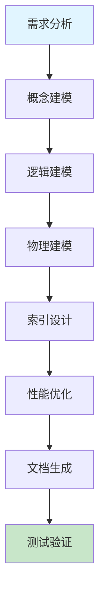

# 数据库设计

系统化的数据库设计方法,涵盖建模、范式化、索引优化和查询性能调优。

## 快速开始

### 5 步上手

1. **准备输入** - 明确业务需求和数据关系
2. **触发技能** - 在 AI 工具中输入 `/database-schema-full`
3. **描述需求** - 提供业务场景和数据模型需求
4. **生成方案** - AI 生成完整的数据库设计方案
5. **迭代优化** - 根据反馈调整数据库设计

### 使用示例

```
/database-schema-full
请设计一个电商系统的数据库 schema，包括：
1. 用户管理
2. 商品管理
3. 订单管理
4. 支付流程
5. 评论系统
要求考虑性能优化和数据一致性
```

## 工作流程



## 加载文件
- [references/guide.md](references/guide.md) - 包含建模、范式、索引方案及高级调优的完整指南
- [references/guide_EN.md](references/guide_EN.md) - English version of the guide
- [rules/leftmost-prefix.md](rules/leftmost-prefix.md) - 索引左前缀原则
- [rules/prevent-n-plus-one.md](rules/prevent-n-plus-one.md) - 避免 N+1 查询问题

## 相关 Skills
| Skill | 用途 |
| --- | --- |
| **api-design** | 定义与数据库交互的数据接口 |
| **performance-tuning** | 系统整体性能瓶颈排查 |
| **technical-design** | 基础设施及中间件选型 |

## 示例
- 📄 [ecommerce-order-schema.md](../../resources/examples/database-schema/ecommerce-order-schema.md)

## 检查清单
- [ ] 表名和字段名是否遵循统一的命名规范 (如小写加下划线)?
- [ ] 每个表是否都包含 `id`, `created_at`, `updated_at` 基础字段?
- [ ] 是否为高频查询字段建立了合适的索引?
- [ ] 索引是否避免了冗余及过度设计?
- [ ] 对于大表分页,是否采用了游标分页 (Seek Method) 而非深偏移?

## 最佳实践

### 数据建模
- ✅ **概念建模** - 使用实体关系图 (ERD) 清晰表达数据关系
- ✅ **逻辑建模** - 定义表结构、字段类型和约束
- ✅ **物理建模** - 考虑具体数据库实现和性能优化
- ✅ **范式设计** - 遵循适当的范式，平衡数据冗余和查询效率

### 索引优化
- ✅ **选择度** - 为高选择度字段建立索引
- ✅ **左前缀原则** - 遵循复合索引的左前缀规则
- ✅ **覆盖索引** - 为频繁查询创建覆盖索引
- ✅ **索引维护** - 定期重建和优化索引
- ✅ **避免过度索引** - 权衡索引收益和维护成本

### 查询优化
- ✅ **EXPLAIN 分析** - 使用执行计划分析查询性能
- ✅ **避免全表扫描** - 确保查询使用索引
- ✅ **减少 N+1 查询** - 使用连接查询或预加载
- ✅ **分页优化** - 对于大表使用游标分页
- ✅ **批量操作** - 减少数据库交互次数

### 数据一致性
- ✅ **事务管理** - 合理使用事务确保数据一致性
- ✅ **外键约束** - 建立适当的外键关系
- ✅ **数据校验** - 在应用层和数据库层都进行数据校验
- ✅ **备份策略** - 定期备份数据，确保数据安全

### 可扩展性
- ✅ **水平扩展** - 考虑分库分表策略
- ✅ **读写分离** - 为读多写少场景设计读写分离
- ✅ **缓存策略** - 合理使用缓存减少数据库压力
- ✅ **数据分片** - 根据业务特点选择合适的分片策略

## 常见问题

**Q: 如何平衡数据库范式和性能?**
A: 在设计初期遵循第三范式，确保数据一致性。然后根据查询性能需求，在适当位置进行反范式设计，如添加冗余字段、使用缓存等。关键是在数据一致性和查询性能之间找到平衡点。

**Q: 如何设计高效的索引?**
A: 遵循以下原则：
1. 为高频查询的过滤字段建立索引
2. 考虑复合索引的顺序（选择性高的字段在前）
3. 避免在索引字段上使用函数
4. 定期分析索引使用情况，移除未使用的索引
5. 注意索引的维护成本，避免过度索引

**Q: 如何处理大数据量的表?**
A: 处理大数据表的策略：
1. 分区表 - 根据时间或范围进行分区
2. 分库分表 - 水平拆分数据
3. 数据归档 - 将历史数据迁移到归档表
4. 读写分离 - 减轻主库压力
5. 缓存 - 使用 Redis 等缓存热点数据
6. 优化查询 - 避免全表扫描，使用覆盖索引

**Q: 如何优化数据库查询性能?**
A: 优化查询的方法：
1. 使用 EXPLAIN 分析执行计划
2. 确保查询使用索引
3. 减少查询返回的字段数量
4. 避免复杂的子查询，使用连接查询
5. 合理使用分页，避免一次性查询大量数据
6. 使用批量操作减少数据库交互次数
7. 定期收集统计信息，帮助优化器生成更好的执行计划

**Q: 如何确保数据库的安全性?**
A: 数据库安全措施：
1. 最小权限原则 - 只授予必要的权限
2. 密码策略 - 使用强密码，定期更换
3. 加密存储 - 敏感数据加密存储
4. 审计日志 - 记录重要操作的审计日志
5. 防火墙 - 限制数据库访问地址
6. 定期备份 - 确保数据安全
7. 防注入 - 使用参数化查询，避免 SQL 注入

## 触发指令

⚠️ **Prompt-as-Code (v5.0)**: 触发指令已迁移至 `metadata.json`。支持：
- `/database-schema-full` - 完整数据库设计
- `/database-schema-quick` - 快速数据库评估

## Token 效率

- 主 Skill 文件: ~300 tokens
- 参考指南总计: ~4k+ tokens