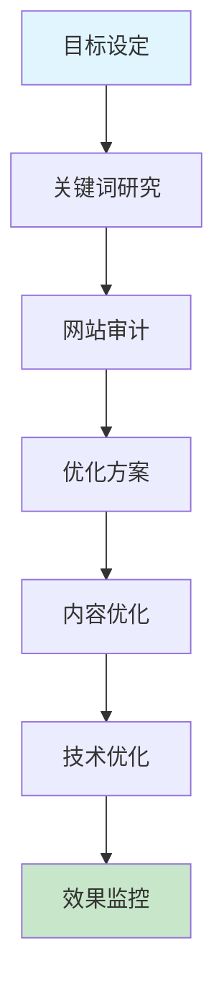

# SEO 优化

全面的 SEO 优化指南,涵盖关键词研究、页面优化和内容策略。

## 快速开始

### 5 步上手

1. **准备输入** - 明确 SEO 优化的目标和范围
2. **触发技能** - 在 AI 工具中输入触发指令
3. **描述需求** - 提供网站信息或关键词
4. **获取分析** - AI 生成详细的 SEO 分析和建议
5. **实施优化** - 根据建议进行优化并监控效果

### 使用示例

```
/seo-optimization-full
请作为 SEO 专家,对我的技术博客网站进行全面审计,识别所有优化空间并提供具体改进方案
```

## 工作流程



## 加载文件
- [references/guide.md](references/guide.md) - 主要指导文档

## 相关 Skills
| Skill | 用途 |
| --- | --- |
| **geo-optimization** | 地理位置及本地化 SEO |
| **blog-writer** | 生成符合 SEO 要求的文案 |

## 示例
- 📄 [blog-seo-audit.md](../../resources/examples/seo-optimization/blog-seo-audit.md)

## 检查清单
- [ ] 明确了当前任务的核心目标
- [ ] 遵循了行业标准的实施流程
- [ ] 产出物经过了基本的质量评审
- [ ] 关键数据或配置已进行备份或版本化
- [ ] 标题和 Meta 描述已优化
- [ ] 关键词密度合理
- [ ] 内部链接结构良好
- [ ] 网站加载速度优化
- [ ] 移动友好性已检查
- [ ] 内容质量和相关性已评估

## 功能特性

- ✅ **关键词研究** - 全面的关键词分析和推荐
- ✅ **网站审计** - 详细的 SEO 问题识别和分析
- ✅ **优化建议** - 具体可实施的改进方案
- ✅ **竞争对手分析** - 竞争格局分析和差异化策略
- ✅ **内容策略** - 基于 SEO 的内容规划和优化
- ✅ **技术 SEO** - 网站技术层面的优化建议
- ✅ **效果监控** - 优化效果的跟踪和分析

## 最佳实践

### 关键词优化
- ✅ **精准定位** - 选择与业务相关的关键词
- ✅ **竞争分析** - 评估关键词竞争程度
- ✅ **长尾关键词** - 利用长尾关键词获取精准流量
- ✅ **关键词布局** - 合理分布关键词在标题、正文和 Meta 标签
- ✅ **语义相关** - 使用语义相关的词汇增强内容相关性

### 内容优化
- ✅ **高质量内容** - 创建有价值、原创的内容
- ✅ **内容长度** - 确保内容长度足够覆盖主题
- ✅ **结构清晰** - 使用标题层级和段落分隔
- ✅ **多媒体内容** - 添加图片、视频等丰富内容
- ✅ **更新频率** - 保持内容的定期更新

### 技术优化
- ✅ **网站速度** - 优化页面加载速度
- ✅ **移动友好** - 确保网站在移动设备上正常显示
- ✅ **网站结构** - 优化网站导航和链接结构
- ✅ **爬虫友好** - 确保搜索引擎能够正确爬取网站
- ✅ **安全协议** - 使用 HTTPS 提高安全性和排名

### 链接建设
- ✅ **内部链接** - 建立合理的内部链接结构
- ✅ **外部链接** - 获取高质量的外部链接
- ✅ **链接质量** - 关注链接的相关性和权威性
- ✅ **锚文本** - 优化链接的锚文本
- ✅ **链接多样性** - 保持链接来源的多样性

### 本地 SEO
- ✅ **Google My Business** - 优化 Google 商家资料
- ✅ **本地关键词** - 针对本地搜索优化关键词
- ✅ **本地评价** - 鼓励客户留下正面评价
- ✅ **本地内容** - 创建与本地相关的内容
- ✅ **NAP 一致性** - 确保名称、地址、电话信息一致

## 常见问题

**Q: 如何选择合适的关键词?**
A: 考虑以下因素：与业务的相关性、搜索量、竞争程度、商业价值、用户意图。使用关键词研究工具如 Google Keyword Planner、Ahrefs、Semrush 等进行分析。

**Q: 如何提高网站的加载速度?**
A: 优化图片大小和格式、启用浏览器缓存、使用内容分发网络(CDN)、压缩 CSS 和 JavaScript 文件、减少重定向、选择高性能的 hosting 服务。

**Q: 如何获取高质量的外部链接?**
A: 创建有价值的内容、参与行业论坛和社区、与行业专家合作、提交到目录网站、创建信息图表和研究报告、修复损坏的链接、参与 guest blogging。

**Q: 如何优化网站的移动友好性?**
A: 使用响应式设计、确保字体大小合适、优化触摸目标大小、减少页面加载时间、避免使用 Flash、测试不同设备上的显示效果。

**Q: 如何监控 SEO 效果?**
A: 使用 Google Analytics 跟踪流量和转化率、使用 Google Search Console 监控排名和点击数据、设置关键词排名跟踪、定期进行网站审计、分析竞争对手的变化。

**Q: 内容长度对 SEO 有影响吗?**
A: 是的，内容长度是一个重要因素。对于博客文章，建议长度为 1000-2000 字，对于深度内容可以更长。关键是内容要全面覆盖主题，提供真正的价值。

**Q: 如何处理重复内容?**
A: 使用 301 重定向、使用 canonical 标签、避免内容抓取问题、创建独特的内容、使用参数处理、监控重复内容问题。

## 触发指令

⚠️ **Prompt-as-Code (v5.0)**: 触发指令已迁移至 `metadata.json`。支持：
- `/seo-optimization-full` - 完整 SEO 审计和优化
- `/seo-keyword-analysis` - 关键词竞争分析
- `/seo-content-strategy` - 基于 SEO 的内容策略
- `/seo-technical-audit` - 技术 SEO 审计

## Token 效率

- 主 Skill 文件: ~300 tokens
- 参考指南总计: ~2k+ tokens