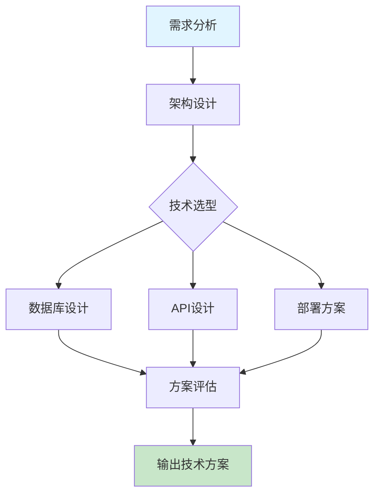

# 技术方案设计

系统架构设计、技术选型及评估框架。

## 快速开始

### 5 步上手

1. **准备输入** - 明确项目需求和业务场景
2. **触发技能** - 在 AI 工具中输入 `/technical-design-full`
3. **描述需求** - 提供业务背景、技术约束和性能要求
4. **生成方案** - AI 生成详细的技术架构方案
5. **迭代优化** - 根据反馈调整架构和技术选型

### 使用示例

```
/technical-design-full
请设计一个高并发电商系统的技术方案，要求：
1. 支持日订单 100 万+
2. 系统响应时间 < 200ms
3. 具备容灾和自动扩缩容能力
4. 技术栈：Java/Go/Python 任选其一
```

## 工作流程



## 加载文件
- [AGENTS.md](AGENTS.md) (核心规则)
- [references/guide.md](references/guide.md) (完整指南)
- [rules/zero-spof.md](rules/zero-spof.md)
- [rules/circuit-breaker.md](rules/circuit-breaker.md)

## 相关 Skills
- **database-schema**, **api-design**, **deployment-guide**

## 示例
- 📄 [architecture-sample.md](../../resources/examples/technical-design/architecture-sample.md)

## 检查清单
- [ ] 设计满足吞吐量及响应时延要求
- [ ] 无单点故障，具备容灾能力
- [ ] 具备熔断、降级或限流机制
- [ ] 关键业务逻辑配备监控指标

## 最佳实践

### 架构设计
- ✅ **分层架构** - 清晰的分层设计，职责分离
- ✅ **模块化** - 高内聚低耦合的模块划分
- ✅ **可扩展性** - 支持水平扩展和功能扩展

### 技术选型
- ✅ **技术栈一致性** - 选择适合团队技术栈的方案
- ✅ **成熟度评估** - 评估技术的稳定性和社区支持
- ✅ **性能考量** - 根据业务特点选择合适的技术

### 可靠性保障
- ✅ **冗余设计** - 关键组件的冗余配置
- ✅ **监控告警** - 完善的监控体系和告警机制
- ✅ **灾备方案** - 详细的灾难恢复计划

### 安全性
- ✅ **安全架构** - 从架构层面考虑安全设计
- ✅ **数据保护** - 敏感数据的加密和保护
- ✅ **权限控制** - 细粒度的权限管理

## 常见问题

**Q: 如何平衡架构复杂度和开发效率?**
A: 采用渐进式架构设计，初期选择简单可行的方案，随着业务发展逐步演进。避免过度设计，关注当前核心需求。

**Q: 如何评估技术选型的合理性?**
A: 从以下维度评估：性能、可靠性、可维护性、社区活跃度、团队熟悉度、成本效益。可以通过 POC 验证关键技术点。

**Q: 如何设计高可用系统?**
A: 遵循以下原则：冗余设计、无单点故障、自动故障转移、健康检查、负载均衡、数据一致性保障。

**Q: 如何处理系统的扩展性?**
A: 采用微服务架构、服务化拆分、容器化部署、自动扩缩容机制、缓存策略优化、数据库分片等技术手段。

**Q: 如何制定合理的性能目标?**
A: 基于业务场景和用户体验，参考业界标准，制定具体的性能指标，如响应时间、吞吐量、并发数等。

## 触发指令

⚠️ **Prompt-as-Code (v5.0)**: 触发指令已迁移至 `metadata.json`。支持：
- `/technical-design-full` - 完整技术方案设计
- `/technical-design-quick` - 快速架构评估

## Token 效率

- 主 Skill 文件: ~300 tokens
- 参考指南总计: ~5k+ tokens
