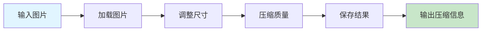

# 图片压缩

减小图像文件大小同时保持质量，帮助用户优化图片加载速度和存储空间。

## 快速开始

### 5 步上手

1. **准备输入** - 准备好需要压缩的图片
2. **触发技能** - 在 AI 工具中输入 `/compress-image-full`
3. **输入图片** - 输入图片路径或 URL
4. **设置参数** - 设置压缩质量和目标尺寸
5. **压缩图片** - AI 自动压缩图片并返回结果

### 使用示例

```
/compress-image-full
图片: https://example.com/image.jpg
质量: 80
尺寸: 1024x768
```

## 工作流程



## 加载文件
- [references/guide.md](references/guide.md) - 图片压缩使用指南

## 相关 Skills
- [image-gen](../../ai-generation/image-gen) - 图像生成工具
- [xhs-images](../../content-generation/xhs-images) - 小红书图片生成

## 示例
- 📄 [示例文件](../../resources/examples/compress-image/sample.md)

## 检查清单
- [ ] 确保图片路径或 URL 正确
- [ ] 设置合适的压缩质量
- [ ] 选择合适的目标尺寸
- [ ] 检查压缩后的图片质量
- [ ] 验证压缩效果（文件大小减小程度）

## 最佳实践

### 压缩质量

- ✅ 对于网络使用，选择 70-85 的质量
- ✅ 对于打印使用，选择 85-95 的质量
- ✅ 对于存档使用，选择 90-95 的质量

### 目标尺寸

- ✅ 对于网页缩略图，使用 200x200 或更小
- ✅ 对于网页内容图片，使用 800x600 或 1024x768
- ✅ 对于社交媒体，使用平台推荐的尺寸

### 图片格式

- ✅ 对于照片，使用 JPEG 格式
- ✅ 对于图标和图形，使用 PNG 格式
- ✅ 对于透明背景，使用 PNG 或 WebP 格式

## 常见问题

**Q: 压缩后图片质量下降严重怎么办？**
A: 提高压缩质量参数，或尝试不同的尺寸设置。

**Q: 压缩后的图片文件大小没有明显减小怎么办？**
A: 尝试降低压缩质量，或减小目标尺寸。

**Q: 无法压缩某些图片怎么办？**
A: 检查图片格式是否支持，确保图片路径或 URL 正确。

**Q: 压缩速度很慢怎么办？**
A: 对于大型图片，压缩可能需要更长时间。可以尝试先减小尺寸再压缩。

## 触发指令

⚠️ **Prompt-as-Code (v5.0)**: 触发指令已迁移至 `metadata.json`。支持：
- `/compress-image-full` - 完整图片压缩，支持质量和尺寸设置
- `/compress-image-quick` - 快速图片压缩，使用默认设置

## Token 效率

- 主 Skill 文件: ~300 tokens
- 参考指南总计: ~2k+ tokens
