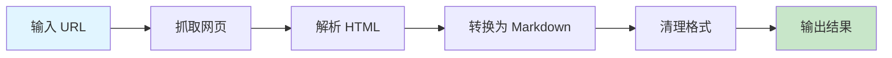

# URL 转 Markdown

将网页内容转换为结构化的 Markdown 格式，方便后续编辑和处理。

## 快速开始

### 5 步上手

1. **准备输入** - 准备好需要转换的网页 URL
2. **触发技能** - 在 AI 工具中输入 `/url-to-markdown-full`
3. **输入 URL** - 输入完整的网页 URL
4. **设置参数** - 设置转换选项（是否包含图片、是否清理格式等）
5. **生成 Markdown** - AI 自动将网页转换为 Markdown 格式

### 使用示例

```
/url-to-markdown-full
URL: https://example.com/article
包含图片: 是
清理格式: 是
```

## 工作流程



## 加载文件
- [references/guide.md](references/guide.md) - URL 转 Markdown 使用指南

## 相关 Skills
- [format-markdown](../format-markdown) - Markdown 格式化工具
- [blog-writer](../../content/blog-writer) - 技术博客写作

## 示例
- 📄 [示例文件](../../resources/examples/url-to-markdown/sample.md)

## 检查清单
- [ ] 确保 URL 格式正确
- [ ] 设置合适的转换选项
- [ ] 检查生成的 Markdown 格式
- [ ] 调整和优化输出内容

## 最佳实践

### 转换选项
- ✅ 根据需要选择是否包含图片
- ✅ 对于复杂网页，启用清理格式选项
- ✅ 对于长文章，可以考虑分段转换

### 输出优化
- ✅ 检查生成的 Markdown 格式是否正确
- ✅ 调整标题层级和段落结构
- ✅ 优化图片链接和引用

## 常见问题

**Q: 转换失败怎么办？**
A: 检查 URL 是否可访问，网络连接是否正常，或者尝试使用不同的转换选项。

**Q: 生成的 Markdown 格式不正确？**
A: 尝试启用清理格式选项，或者手动调整生成的 Markdown 内容。

**Q: 图片转换失败？**
A: 确保网页中的图片可以正常访问，或者尝试使用图片压缩工具优化图片。

## 触发指令

⚠️ **Prompt-as-Code (v5.0)**: 触发指令已迁移至 `metadata.json`。支持：
- `/url-to-markdown-full` - 完整转换，包含所有选项
- `/url-to-markdown-quick` - 快速转换，使用默认选项

## Token 效率

- 主 Skill 文件: ~300 tokens
- 参考指南总计: ~2k+ tokens
